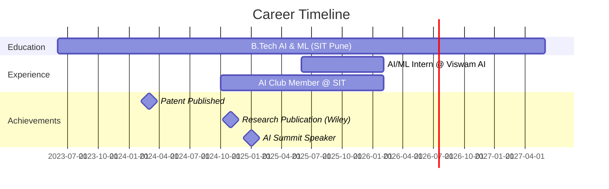

<div align="center">

<!-- Animated Typing Header -->


<h3>🎓 B.Tech – AI & ML @ Symbiosis Institute of Technology, Pune</h3>

<!-- Social Badges with Animation -->
<p>
  <a href="https://www.linkedin.com/in/arjun57561">
    
  </a>
  <a href="mailto:mallikarjun57561@gmail.com">
    
  </a>
  <a href="https://github.com/Arjun-57561">
    
  </a>
  <a href="https://orcid.org/0009-0004-4624-1747">
    
  </a>
</p>

<!-- Profile Views Counter -->


<!-- Animated Divider -->


</div>

## 🚀 About Me

```python
class AIEngineer:
    def __init__(self):
        self.name = "Bontha Mallikarjun Reddy"
        self.role = "AI/ML Developer & Researcher"
        self.education = "B.Tech AI & ML @ SIT Pune"
        self.cgpa = 7.60
        self.current_work = "AI/ML Engineering Intern @ Viswam AI"
        self.philosophy = "Curiosity transforms a generalist into an innovator"
    
    def get_expertise(self):
        return {
            "focus_areas": [
                "Production-grade AI systems",
                "Deep Learning & Computer Vision",
                "Healthcare AI applications",
                "Multimodal ML solutions"
            ],
            "passion": "Building AI that creates real-world impact 🎯"
        }
```

> 💡 **Current Focus:** Developing scalable ML solutions & contributing to AI research in healthcare domains


## 🏆 Achievements & Recognition

<table>
<tr>
<td width="50%">

### 📜 Patent & Publications
- **🔬 Patent Published** (2024)  
  *Patent No. 202421016116 A*  
  AI-powered mobile application

- **📚 Research Paper** (Wiley, 2024)  
  *Early Hypoglycemia Prediction*  
  Published in Public Health Nursing

</td>
<td width="50%">

### 🎤 Speaking & Recognition
- **🎙️ AI Summit 2025**  
  Speaker on Deepfake Detection

- **🥈 New India Vibrant Hackathon**  
  Finalist | Gandhinagar (2023)

- **🎓 Certifications**  
  Postman API Expert | IoT with AI

</td>
</tr>
</table>


## 💻 Tech Arsenal

<div align="center">

### Languages & Frameworks
<p>


</p>

### Cloud & DevOps
<p>


</p>

### Data Science & Visualization
<p>


</p>

</div>


## 🌟 Featured Projects

<div align="center">

<table>
<tr>
<td width="50%">

### 🎭 [Deepfake Detection System](https://github.com/Arjun-57561)
**Hybrid CNN + Swin Transformer Model**

🎯 Real-time deepfake detection  
📊 68% accuracy on FaceForensics++  
🖥️ Interactive Streamlit interface

`TensorFlow` `OpenCV` `Streamlit` `Computer Vision`

---

### 🏥 [Med AI Care Platform](https://github.com/Arjun-57561)
**Multimodal Medical AI Assistant**

🌐 11+ language support  
🤖 Speech, Vision & Text AI  
💊 Comprehensive diagnostics

`PyTorch` `Transformers` `Flask` `NLP`

</td>
<td width="50%">

### 📄 [AI Resume Shortlisting](https://github.com/Arjun-57561)
**Semantic Matching Platform**

🧠 LLM-powered candidate matching  
⚡ FAISS vector search  
📈 Hugging Face models

`Python` `React` `FAISS` `LLMs`

---

### 🔥 [IoT Gas Leakage Detection](https://github.com/Arjun-57561)
**AI-Integrated IoT System**

📡 Real-time monitoring  
☁️ AWS cloud integration  
🚨 Instant alert system

`Python` `ESP32` `AWS` `ThingSpeak`

</td>
</tr>
</table>

<a href="https://github.com/Arjun-57561?tab=repositories">
  
</a>

</div>


## 📊 GitHub Analytics

<div align="center">
  
  
</div>

<div align="center">
  
  
</div>

<!-- GitHub Trophies -->


## 💼 Professional Journey



<table>
<tr>
<td>

### 🚀 Current Role
**AI/ML Engineering Intern**  
📍 Viswam AI | June 2025 – Present

- Developing production-grade AI/ML models
- Deploying enterprise AI applications
- Collaborating on cutting-edge ML projects

</td>
<td>

### 🎓 Academic Engagement
**AI Club Member**  
📍 Symbiosis Institute of Technology

- Conducting technical workshops
- Leading AI initiatives
- Mentoring peers in ML projects

</td>
</tr>
</table>


## 📫 Let's Connect!

<div align="center">

### 💬 Open for collaborations in AI/ML research, innovative projects, and tech discussions!

<p>
<a href="https://www.linkedin.com/in/arjun57561">
  
</a>
<a href="mailto:mallikarjun57561@gmail.com">
  
</a>
<a href="https://github.com/Arjun-57561">
  
</a>
</p>

📍 **Location:** Pune / Hyderabad, India  
📧 **Email:** mallikarjun57561@gmail.com  
🔗 **Portfolio:** [Coming Soon]

<!-- Animated Snake eating contributions -->
<picture>
  <source media="(prefers-color-scheme: dark)" srcset="https://raw.githubusercontent.com/Arjun-57561/Arjun-57561/output/github-contribution-grid-snake-dark.svg">
  <source media="(prefers-color-scheme: light)" srcset="https://raw.githubusercontent.com/Arjun-57561/Arjun-57561/output/github-contribution-grid-snake.svg">
  
</picture>

</div>

---

<div align="center">

### 💭 *"Imagination is the blueprint; innovation is the architecture."*

**⭐ Star my repositories if you find them interesting!**


</div>
